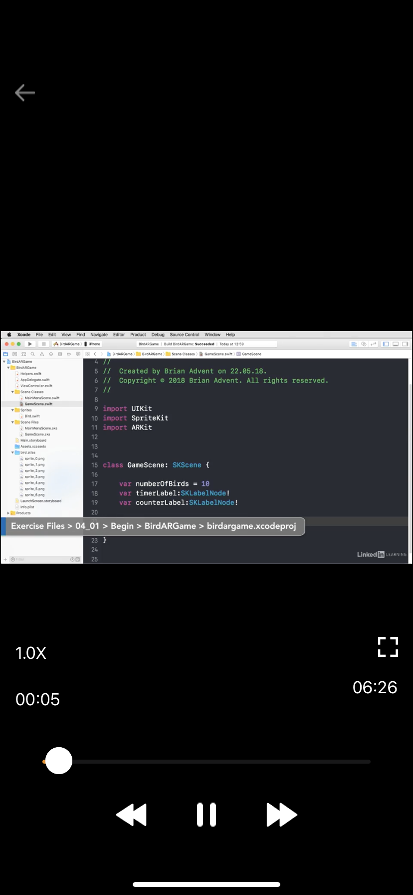

# muzic_player
#### Description:
>Muzic player is an offline music application which allows you to manage and play music or videos in the mobile phone's files. Function includes:
- Play music/video. Change playback, play next, previous, repeat
- Delete, sort track/video
- Create playlist, play playlist: repeat, next, previous, delete, rename playlist
- Search by category
> Swift, Xcode, Cocoapod
## Features
I've used xcode and cocoapod framework based in Swift.
Besides i used some extension library such as SCLAlertView, EVTopTabBar, ...
My main database is Realm Swift
## Explaining the project and the database
- First of all, you need to import video or music from the file in your mobile phone into the application. Then you will have music/video playlists. Now your local file will be saved in database of app (Realm Swift)

- You can play all of music/video in app with all advantage of changing playback, repeating, playing all playlist, playing next or previous, watching full video, ...
  
- After users finish listening to the video, it will display in the list of recently watched videos which saved in database.
  
-  Users can also sort the order of videos according to the 4 criteria above. In terms of playlist mode, users can create their own playlists, rename, delete, and play entire.
  
- Finally, the search function allows users to search by the song category they need.

### Object database in Realm Swift:

- First is Song. This object includes name, artistName, imageName, trackName, albumName, id, urlString, imageData
  
- Second is Video. This object includes videoName and urlString
  
- Third is Album. This object includes a list of Songs and an album name
  
- Fourth is Playlist. This object includes the video/song list and playlist name
  
- Finally, Recent Videos/Recent Songs. This object includes the video/song list and count

Get all object saved in Database
```swift
func load<T: Object>(listOf: T.Type) -> [T] {
      do {
          let objects = try Realm().objects(T.self)
          var list = [T]()
          for obj in objects {
              list.append(obj)
          }
          return list
      } catch {}
      return []
  }
```

Add new object to Database
```swift
func add(_ object : Object ) {
      do{
          let realm = try! Realm()
          try! realm.write {
              realm.add(object)
          }
      }catch{
          print ("Can't add")
      }
  }
``` 
### Play music and video.
- Setup Music/Video
```swift
try AVAudioSession.sharedInstance().setMode(.default)
try AVAudioSession.sharedInstance().setActive(true, options: .notifyOthersOnDeactivation)
try AVAudioSession.sharedInstance().setCategory(AVAudioSession.Category.playback)

str = UserDefaults.standard.string(forKey: "url")! + videos[position].urlString!
let videoPathURL = URL(string: str)
player = AVPlayer(url: videoPathURL! as URL)
playerLayer = AVPlayerLayer(player: player)
playerLayer.frame = self.view.frame
self.view.layer.addSublayer(playerLayer)
```
- Play music/video
```swift
player.play()
```

## Pictures
- List Video and Play Video screen

| List Videos | Play Video |
| :---: | :---: |
|   | |

- Recent Music and Sort screen

| Recent Music | Sort |
| :---: | :---: |
|  | 

- Search screen

| Search |
| :---: |
|  |

#### Video Demo:
For the CS50 final project you have to make a video showning your project,
[MUZIC PLAYER](https://youtu.be/if2wiRfEgyM)

## Documentation
- [Link tai lieu Realm Swift](https://realm.io/realm-swift/)
- [Link tai lieu AVPlay](https://developer.apple.com/documentation/avfoundation/avplayer/)
- [Link tai lieu Swift doc](https://www.swift.org/documentation/)

## About CS50
CS50 is a openware course from Havard University and taught by David J. Malan

Through the cs50 course, I have improved my ability to code algorithms. Besides, I also got acquainted with many newer languages ​​such as python, js and new frameworks like flask

Thank you for all CS50.

- Where I get CS50 course?
https://cs50.harvard.edu/x/2023/
